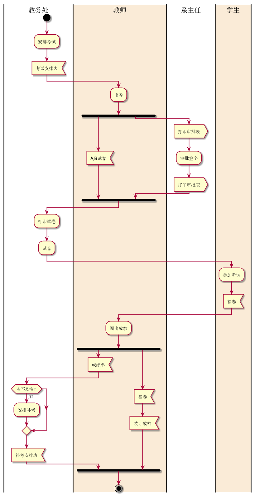
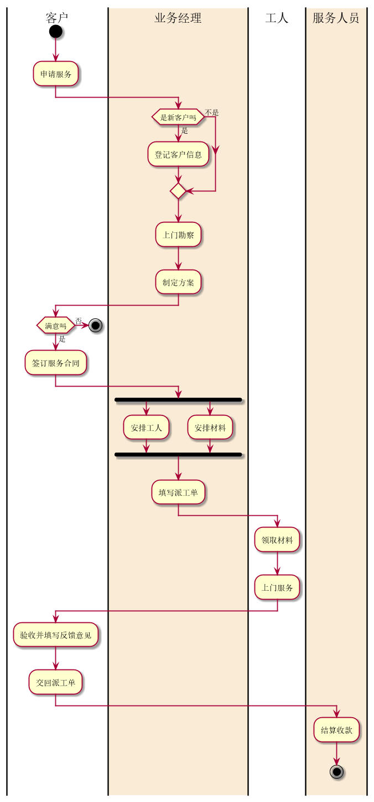

# 实验1：业务流程建模
|学号|班级|姓名|照片|
|:-------:|:-------------: | :----------:|:---:|
|201510414117|软件(本)15-1|秦著||

## 流程图1：考试及成绩管理流程

**PlantUML源码如下：**

``` flow1
@startuml
|教务处|
start
:安排考试;
:考试安排表<
|#AntiqueWhite|教师|
:出卷;
fork
    :A,B试卷<
fork again
   |系主任|
   :打印审批表>
   :审批签字;
   :打印审批表>
   |系主任|
end fork
|教务处|
:打印试卷;
:试卷;
|教务处|
|#AntiqueWhite|学生|
:参加考试;
:答卷<
|#AntiqueWhite|学生|
|#AntiqueWhite|教师|
:阅出成绩;
fork
    :成绩单<
    |教务处|
    if( 有不及格？) then( 有 )
        :安排补考;
     endif
     :补考安排表<
     |教务处|
fork again
    |教师|
    :答卷<
    :装订成档<
    |教师|
|教师|
|教务处|
|教师|
end fork
stop
@enduml
```

**业务流程图如下：**




## 流程图2： 客户维修服务流程

**PlantUML源码如下：**

``` flow2
@startuml
|客户|
start
:申请服务;
|客户|
|#AntiqueWhite|业务经理|
if(是新客户吗) then(是)
    :登记客户信息;
else(不是)
endif
:上门勘察;
:制定方案;
|#AntiqueWhite|业务经理|
|客户|
if(满意吗) then(否)
    stop
else (是)
    :签订服务合同;
|客户|
|#AntiqueWhite|业务经理|
fork
    :安排工人;
fork again
    :安排材料;
end fork
:填写派工单;
|#AntiqueWhite|业务经理|
|工人|
:领取材料;
:上门服务;
|工人|
|客户|
:验收并填写反馈意见;
|客户|
:交回派工单;
|#AntiqueWhite|服务人员|
:结算收款;
|#AntiqueWhite|服务人员|
stop
@enduml
```

**业务流程图如下：**


