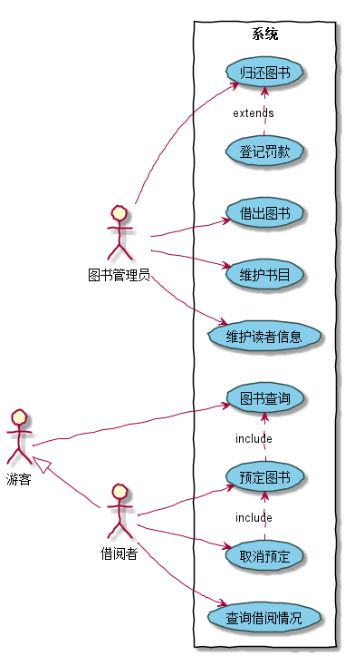
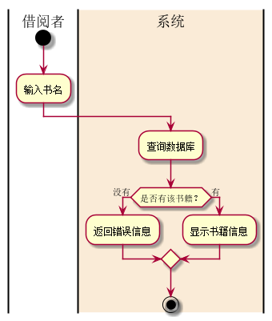
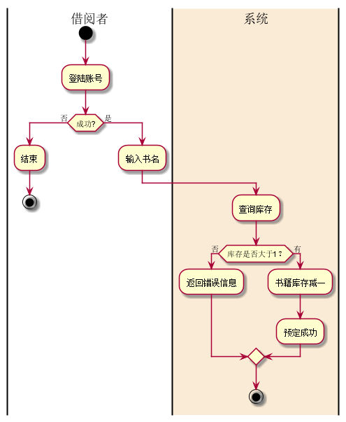
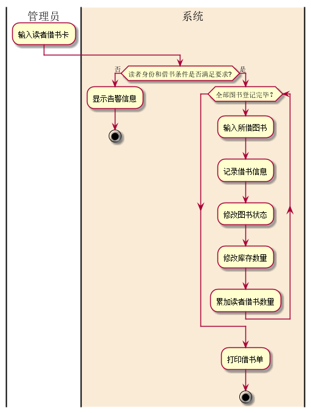
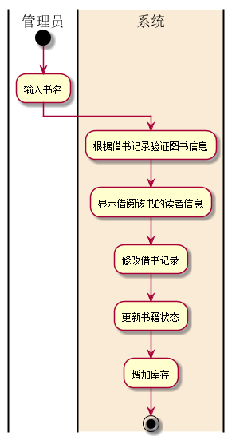

# 实验1：业务流程建模
|学号|班级|姓名|照片|
|:-------:|:-------------: | :----------:|:---:|
|201510414117|软件(本)15-1|秦著||

## 实验二（test2）：图书管理系统用例建模

### 1.图书管理系统整体的用例关系图
**1.1PlantUML源码如下：**
~~~
@startuml
left to right direction
skinparam handwritten true
skinparam usecase {
	BackgroundColor SkyBlue
	BorderColor DarkSlateGray
}
图书管理员 as gly
借阅者 as jyz
游客 as yk
yk <|-- jyz
rectangle 系统 {
  yk-->(图书查询)
  jyz-->(预定图书)
  jyz-->(取消预定)
  jyz-->(查询借阅情况)
  gly-->(借出图书)
  gly-->(归还图书)
  gly-->(维护书目)
  gly-->(维护读者信息)

  (预定图书).>(图书查询):include
  (取消预定).>(预定图书):include
  (登记罚款).>(归还图书):extends
}
@enduml
~~~
**1.2用例图如下：**

### 2.参与者说明

**2.1管理员**

维护图书，读者信息，负责图书的借还，罚款。

**2.2游客**

查询书籍

**2.3借阅者**

拥有游客的功能，且具有预订和取消预订图书功能

### 3.用例的规约表

**3.1“图书查询”用例**

***3.1.1用例规约***

|用例名称|图书查询|
|:-----------:|:-----------------------:|
|参与者|读者或游客|
|前置条件|访问系统|
|后置条件|查询到图书信息|
|主事件流|1.输入书名 2.查询数据库 3.显示书籍信息|
|备选事件流|1.书名不存在 2.显示告警信息|

***3.1.2流程图源码***

~~~
@startuml
|借阅者|
start
:输入书名;
|借阅者|
|#AntiqueWhite|系统|
:查询数据库;
if(是否有该书籍？)then(没有)
    :返回错误信息;
else(有)
    :显示书籍信息;
endif
stop
|系统|
@enduml
~~~

***3.1.3流程图***

**3.2“预定图书”用例**

***3.2.1用例规约***

|用例名称|预定图书|
|:-----------:|:-----------------------:|
|参与者|借阅者|
|前置条件|登陆到系统|
|后置条件|预定书籍|
|主事件流|1.输入书名 2.查询数据库 3.验证库存足够 4.预定成功 5.修改书籍状态 6.书籍库存减一|

***3.2.2流程图源码***

~~~
@startuml
|借阅者|
start
:登陆账号;
if(成功?)then(否)
    :结束;
    stop
else(是)
    :输入书名;
    |借阅者|
    |#AntiqueWhite|系统|
    :查询库存;
    if(库存是否大于1？)then(否)
        :返回错误信息;
    else(有)
        :书籍库存减一;
        :预定成功;
    endif
    stop
    |系统|
@enduml
~~~

***3.2.3流程图***

**3.3“借出图书”用例**

***3.3.1用例规约***

|用例名称|借出图书|
|:-----------:|:-----------------------:|
|参与者|借阅者和图书管理员|
|前置条件|图书管理员已经授权|
|后置条件|图书出借，存储记录，书库减一|
|主事件流|1.输入书名 2.验证读者身份和借阅条件 3.验证库存足够 4.借阅成功 5.修改书籍状态 6.书籍库存减一|
|备注|每本书都是可识别的|

***3.3.2流程图源码***

~~~
@startuml
|管理员|
:输入读者借书卡;
|管理员|
|#AntiqueWhite|系统|
if(读者身份和借书条件是否满足要求?)then(否)
    :显示告警信息;
    stop
else(是)
    while(全部图书登记完毕？)
    :输入所借图书;
    :记录借书信息;
    :修改图书状态;
    :修改库存数量;
    :累加读者借书数量;
    endwhile
    :打印借书单;
    stop
endif
|系统|
@enduml
~~~

***3.3.3流程图***

**3.4“归还图书”用例**

***3.4.1用例规约***

|用例名称|归还图书|
|:-----------:|:-----------------------:|
|参与者|借阅者和图书管理员|
|前置条件|图书管理员已经授权|
|后置条件|图书状态修改，删除借书记录，书库加一|
|主事件流|1.输入书名 2.系统根据借书记录验证图书信息 3.显示该借阅者的信息 4.归还成功 5.修改书籍状态 6.书籍库存加一|

***3.4.2流程图源码***

~~~
@startuml
|管理员|
start
:输入书名;
|管理员|
|#AntiqueWhite|系统|
:根据借书记录验证图书信息;
:显示借阅该书的读者信息;
:修改借书记录;
:更新书籍状态;
:增加库存;
stop
|#AntiqueWhite|系统|
@enduml
~~~

***3.4.3流程图***

