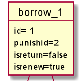

# 实验3：图书管理系统领域对象建模(秦著)
|学号|班级|姓名|照片|
|:-------:|:-------------: | :----------:|:---:|
|201510414117|软件(本)15-1|秦著||

## 1. 图书管理系统的类图

### 1.1 Bean类图PlantUML源码如下：

``` class
@startuml
scale 750 width
package com.qinzhu.bean <<Folder>> {
  Borrow"1"*-"1"BorrowId
  Reader "1"-- "*" Book
  ReaderCat"1" o- "1..*"Reader
  BookCat"1" o- "1..*"Book
  Reader"1"--"*"Punish
  class Book{
  ..列举了部分私有属性..
  	- Integer id;
  	- Integer bookcat;
  	- String bookname;
  	- Float price;
  	-Integer borrowCount
  	- String publish;
  	- Date pubdate;
  }
  class BookCat{
    - Integer id;
    - Integer parentid;
    - Boolean isparent;
    - String name;
  }
  class Borrow{
    - BorrowId id;
    - Integer punishid;
    - Boolean isreturn;
    - Boolean isrenew;
    - Date time;
  }
  class BorrowId{
    - Integer bookid;
    - Integer readerid;
  }
  class Punish{
  - Integer id;
  - Integer hourlong;
  - Float fine;
  }
  class Reader{
  	- Integer id;
  	- Integer readercat;
  	- Integer studentno;
  	- String password;
  	- String name;
  	- String sex;
  	- String belong;
  	- Integer borrowcount;
  	- String picture;
  }
  class ReaderCat{
  	- Integer id;
  	- String name;
  }
}

@enduml
```

### 1.2. Bean类图如下：


### 1.3. 类图说明：
book图书类，bookcat图书类目类，reader读者类，readercat读者类目类
borrow图书借阅类，borrowId图书借阅id类，punish罚金类
一个图书类目下允许有多个图书，一个读者类目下允许有多个读者
读者和图书的借阅关系是多对多，通过“借阅类”这个中间类来实现多对多，
罚金和读者的关系是多对一

### 1.4 Dao图PlantUML源码如下：

```class
@startuml
package com.qinzhu.dao <<Folder>> {
  interface BookDao{
  	+{abstract} int findAllSize();
    +{abstract} void saveorupdate(Book book);
    +{abstract} void deleteOne(int id);
    +{abstract} Book findOne(int id);
    +{abstract} List<Book> findAll();
    +{abstract} int selectLastId();
  }
  interface BorrowDao{
  	+{abstract} int findAllSize();
  	+{abstract} void saveorupdate(Borrow borrow);
  	+{abstract} void deleteOne(BorrowId id);
  	+{abstract} Borrow findOne(BorrowId id);
  	+{abstract} List<Borrow> findList(int readerid);
  	+{abstract} List<Borrow> findAll();
  }
  interface ReaderDao{
  	+{abstract}  int findAllSize();
  	+{abstract}  void saveorupdate(Reader reader);
  	+{abstract} void deleteOne(int id);
  	+{abstract} Reader findOne(int id);
  	+{abstract} Reader findOneBystuno(int stuno);
  	+{abstract} List<Reader> findAll();
  	+{abstract} int selectLastId();
  }
}
package com.qinzhu.daoImpl <<Folder>> {
    BookDao <|.. BookDaoImpl
    BorrowDao <|.. BorrowDaoImpl
    ReaderDao <|.. ReaderDaoImpl
    class BookDaoImpl{
      	+ int findAllSize();
        + void saveorupdate(Book book);
        + void deleteOne(int id);
        + Book findOne(int id);
        + List<Book> findAll();
        + int selectLastId();
    }
    class BorrowDaoImpl{
      	+ int findAllSize();
      	+ void saveorupdate(Borrow borrow);
      	+ void deleteOne(BorrowId id);
      	+ Borrow findOne(BorrowId id);
      	+ List<Borrow> findList(int readerid);
      	+ List<Borrow> findAll();
    }
    class ReaderDaoImpl{
      	+  int findAllSize();
      	+  void saveorupdate(Reader reader);
      	+ void deleteOne(int id);
      	+ Reader findOne(int id);
      	+ Reader findOneBystuno(int stuno);
      	+ List<Reader> findAll();
      	+ int selectLastId();
    }
}

@enduml
```

### 1.5. Dao类图如下：


### 1.6. 类图说明：

Impl类是dao类的实现类，用于实现在dao类中定义的方法
ReaderDaoImpl用于对读者进行CURD操作
BorrowDaoImpl用于对借阅表进行CURD操作
BookDaoImpl用于对书籍类进行增删查改操作

## 2. 图书管理系统的对象图
### 2.1 类ReaderCat的对象图
#### 源码如下：
``` class
object readercat {
  id = 1
  name = "大会员"
}
@enduml
``` 
#### 对象图如下：


### 2.2 类Reader的对象图
#### 源码如下：
``` class
    id= 1
    studentno=201510414117
    name="秦著"
    password= 123456789
    sex= "male"
    belong="1"
    borrowcount=16
    picture="a.png"
@enduml
``` 
#### 对象图如下：


### 2.3 类Book的对象图
#### 源码如下：
```class
object book_1{
  	id=12
  	bookcat=1
  	bookname="高等数学"
  	isbn="2015-13-1567-45"
  	publish=1
}
```
#### 对象图如下：


### 2.4 类Borrow的对象图
#### 源码如下：
```class
object borrow_1{
  id= 1
  punishid=2
  isreturn=false
  isrenew=true
}
```
#### 对象图如下：


### 2.5 类BorrowId的对象图
#### 源码如下：
```class
object borrowId_1{
  bookid=12
  readerid=1
}
```

#### 对象图如下：


### 2.6 类Punish的对象图
#### 源码如下：
```class
object borrowId_1{
  bookid=12
  readerid=1
}
```
#### 对象图如下：


### 2.7 对象们的关系图:


