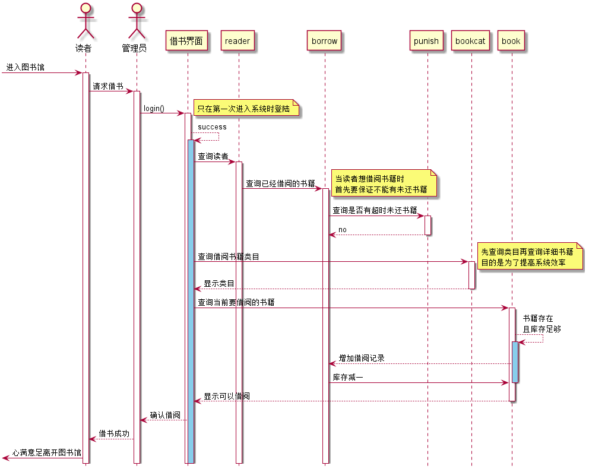
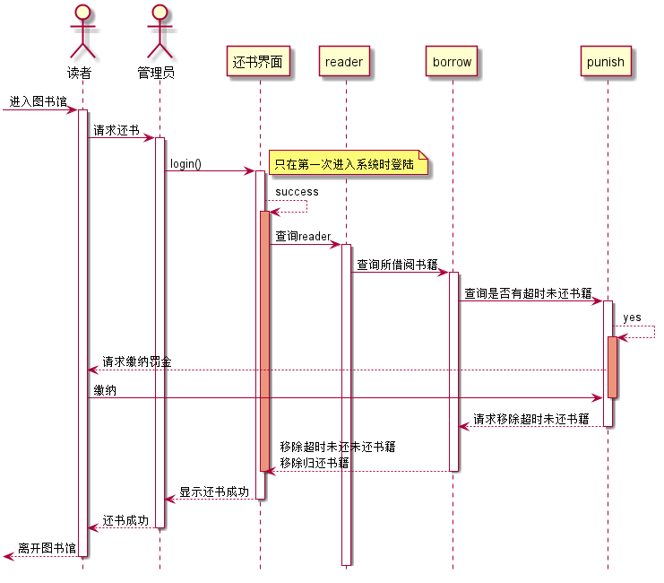
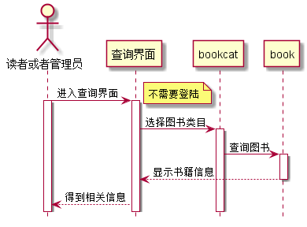
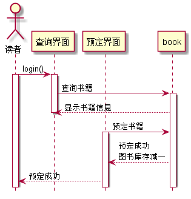
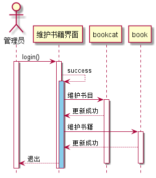

# 实验4：图书管理系统顺序图绘制
|学号|班级|姓名|照片|
|:-------:|:-------------: | :----------:|:---:|
|201510******|软件(本)15-1|*著| |

## 1. 借书用例

### 1.1 借书用例PlantUML源码

``` class
@startuml
hide footbox
actor 读者
actor 管理员
participant 借书界面
participant reader
participant borrow
participant punish
participant bookcat
participant book
[->读者:进入图书馆
activate 读者
读者->管理员:请求借书
activate 管理员
管理员->借书界面:login()
note right:只在第一次进入系统时登陆
activate 借书界面
借书界面-->借书界面:success
activate 借书界面 #SkyBlue
借书界面->reader:查询读者
activate reader
reader->borrow:查询已经借阅的书籍
note right:当读者想借阅书籍时\n首先要保证不能有未还书籍
activate borrow
borrow->punish:查询是否有超时未还书籍
activate punish
punish-->borrow:no
deactivate punish
借书界面->bookcat:查询借阅书籍类目
activate bookcat
note right:先查询类目再查询详细书籍\n目的是为了提高系统效率
bookcat-->借书界面:显示类目
deactivate bookcat
借书界面->book:查询当前要借阅的书籍
activate book
book-->book:书籍存在\n且库存足够
activate book #SkyBlue
book-->borrow:增加借阅记录
borrow->book:库存减一
deactivate book
book-->借书界面:显示可以借阅
deactivate book
借书界面-->管理员:确认借阅
管理员-->读者:借书成功
[<-读者:心满意足离开图书馆
@enduml
```

### 1.2. 借书用例时序图



### 1.3. 借书用例时序图说明：
book图书类，reader读者类，borrow图书借阅类，punish罚金类
读者进入图书馆后找管理员提出借书要求，管理员登陆系统然后首先根据读者的id
查询到reader，查询界面会显示该读者已经借阅的书籍，如果有超时未归还的
书籍，页面上会显示出来，提醒管理员向读者索取罚金，读者缴纳罚金后，
再查询借阅书籍，若库存足够则借阅成功


## 2. 还书用例时序图
### 2.1 还书用例PlantUML源码
``` class
@startuml
hide footbox
actor 读者
actor 管理员
participant 还书界面
participant reader
participant borrow
participant punish
[->读者:进入图书馆
activate 读者
读者->管理员:请求还书
activate 管理员
管理员->还书界面:login()
note right:只在第一次进入系统时登陆
activate 还书界面
还书界面-->还书界面:success
activate 还书界面 #DarkSalmon
还书界面->reader:查询reader
activate reader
reader->borrow:查询所借阅书籍
activate borrow
borrow->punish:查询是否有超时未还书籍
activate punish
punish-->punish:yes
activate punish #DarkSalmon
punish-->读者:请求缴纳罚金
读者->punish:缴纳
deactivate punish
punish-->borrow:请求移除超时未还书籍
deactivate punish
borrow-->还书界面:移除超时未还未还书籍\n移除归还书籍
deactivate borrow
deactivate 还书界面
还书界面-->管理员:显示还书成功
deactivate 还书界面
管理员-->读者:还书成功
deactivate 管理员
[<--读者:离开图书馆
deactivate 读者
@enduml
``` 
### 2.2. 还书用例时序图


### 2.3. 还书用例时序图说明：

管理员成功登入系统后，读者来归还书籍，首先根据读者ID
查询读者所借阅书籍，若有超时未归还则让读者缴纳罚金，
成功缴纳后则归还书籍，borrow删除记录，punish删除记录
图书库存加一

## 3. 图书查询用例

### 3.1 图书查询PlantUML源码

```aidl
@startuml
hide footbox
actor 读者或者管理员 as d
participant 查询界面 as c
participant bookcat
participant book
d->c:进入查询界面
activate d
note right:不需要登陆
activate c
c->bookcat:选择图书类目
activate bookcat
bookcat -> book:查询图书
activate book
book-->c:显示书籍信息
deactivate book
c-->d:得到相关信息
@enduml
```
### 3.2. 图书查询时序图


### 3.3. 图书查询用例时序图说明：

读者不比登陆，进入查询页面，先选择相关分类，然后再在
分类下选择需要查询的书籍，系统会显示书籍的相关信息

## 4. 图书预定用例

### 4.1 图书预定PlantUML源码

```aidl
@startuml
hide footbox
actor 读者 as d
participant 查询界面 as c
participant 预定界面 as y
participant book
d->c:login()
activate d
activate c
c->book:查询书籍
activate book
book-->c:显示书籍信息
deactivate c
y->book:预定书籍
activate y
book-->y:预定成功\n图书库存减一
y-->d:预定成功
@enduml
```
### 4.2. 图书预定时序图


## 5. 维护书目用例

### 5.1 维护书目PlantUML源码

```aidl
@startuml
hide footbox
actor 管理员
participant 维护书籍界面
participant bookcat
participant book
管理员->维护书籍界面:login()
activate 管理员
activate 维护书籍界面
维护书籍界面-->维护书籍界面:success
activate 维护书籍界面 #SkyBlue
维护书籍界面->bookcat:维护书目
activate bookcat
bookcat-->维护书籍界面:更新成功
维护书籍界面->book:维护书籍
activate book
book-->维护书籍界面:更新成功
维护书籍界面-->管理员:退出
deactivate book
deactivate bookcat
deactivate bookcat
@enduml
```
### 5.2. 维护书目时序图


### 5.3. 维护书目用例时序图说明：

管理员登陆系统进入维护书目界面，对书目和书籍进行更新维护


