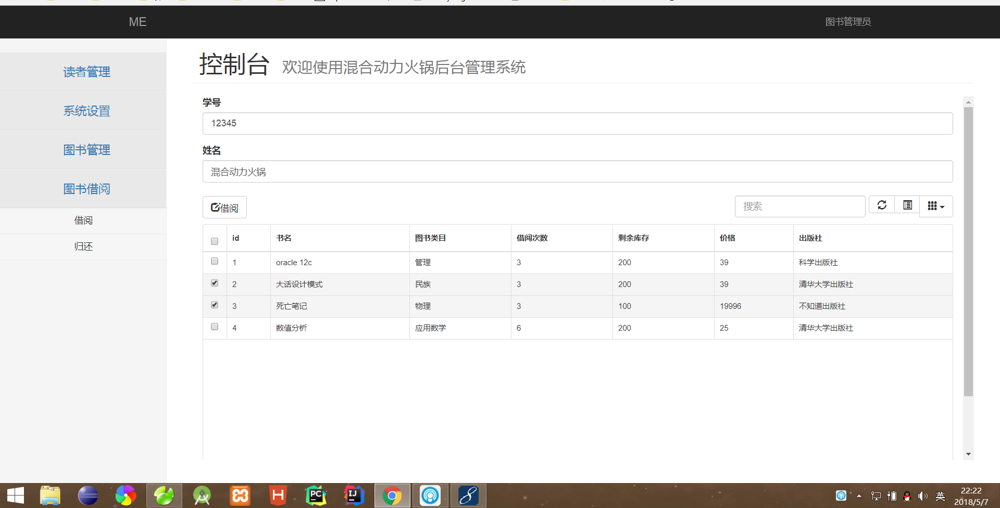

# 实验5：图书管理系统数据库设计与界面设计
|学号|班级|姓名|照片|
|:-------:|:-------------: | :----------:|:---:|
|201510******|软件(本)15-1|*著||

## 1.数据库表设计

## 1.1. 读者类目表
|字段|类型|主键，外键|可以为空|
|:-------:|:-------------:|:------:|:----:|
|id|int(100)|主键|否|
|cat|varchar2(20)| |否|

## 1.2. 读者表
|字段|类型|主键，外键|可以为空|说明|
|:-------:|:-------------:|:------:|:----:|:---:|
|id|varchar2(100)|主键|否| |
|readercat|int(100)|外键 |否| |
|studentno|varchar2(100)| |否|学号作为读者登陆本系统的账号|
|password|varchar2(100)| |否| |
|name|varchar2(10)| |否| |
|sex|varchar2(10)| |否| |

## 1.3. 图书类目表
|字段|类型|主键，外键|可以为空|说明|
|:-------:|:-------------:|:------:|:----:|:---:|
|id|int(100)|主键|否| |
|parentid|int(10)| |否|从属哪个父类|
|isparent|int(10)| |否|是否包含子类目|

## 1.4. 图书表
|字段|类型|主键，外键|可以为空|
|:-------:|:-------------:|:------:|:----:|
|id|int(100)|主键|否|
|bookCat|varchar2(100)| |否|
|bookName|varchar2(100)| |否|
|isbn|varchar2(100)| |否|
|publish|varchar2(100)| |是|
|pubdate|data| |是|


## 1.5. 借阅Id表
|字段|类型|主键，外键|可以为空|
|:-------:|:-------------:|:------:|:----:|
|id|int(100)|主键|否|
|bookId|int(100)|外键|否|
|readId|int(100)|外键|否|

## 1.6. 借阅表
|字段|类型|主键，外键|可以为空|说明|
|:-------:|:-------------:|:------:|:----:|:---:|
|id|int(100)|主键|否| |
|punishid|int(100)|外键|否|关联罚金表|
|isreturn|int(1)| |否|书籍是否归还|
|isrenew|int(1)| |否| 是否续借书籍|
|time|data| |否| |

## 1.7. 罚金表
|字段|类型|主键，外键|可以为空|说明|
|:-------:|:-------------:|:------:|:----:|:---:|
|id|int(100)|主键|否| |
|hourlong|int(100)| | 否|已借阅时间|
|fine|int(1)| |否|处罚金额|

***

## 2. 界面设计
## 2.1. 借书界面设计

- 用例图参见：借书用例
- 类图参见：借书类，读者类
- 顺序图参见：借书顺序图
- API接口如下：

1. 分页显示书籍

- 功能：用于显示书籍
- 请求地址： http://[DOMAIN]/api/getbooks
- 请求方法：POST
- 请求参数：

|参数名称|必填|说明|
|:-------:|:-------------: | :----------:|
|page_index|是|根据页号得到书籍|
|method|是|固定为 “GET”。|

- 返回实例：
```
{
    "next_index": "2",
    "book": {
        "bookname": "oracle 12c",
        "bookcat": "管理",
        "publish": "科学出版社",
        "booknum": "200",
        "借阅次数":"3",
        "价格":"39"
    },
    "book": {
        "bookname": "大话设计模式",
        "bookcat": "民族",
        "publish": "清华大学出版社",
        "booknum": "200",
        "借阅次数":"3",
        "价格":"39"
          },
    "code": 200
}
```
- 返回参数说明：
    
|参数名称|说明|
|:-------:|:-------------: |
|next_index|下一页的索引|
|book|书籍信息|
|code|返回码|

2. 查询读者
- 功能：用于获取全部分类
- 请求地址： http://[DOMAIN]/api/getreaders
- 请求方法：POST
- 请求参数：

|参数名称|必填|说明|
|:-------:|:-------------: | :----------:|
|readerid|是|用于查询读者信息|

- 返回实例：
```
{
    "reader": {
        "readercat": "良",
        "name": "混合动力火锅",
     },
    "code": 200
}
```
- 返回参数说明：
    
|参数名称|说明|
|:-------:|:-------------: |
|reader|读者信息|
|code|返回码|

3. 借阅书籍
- 功能：用于获取全部分类
- 请求地址： http://[DOMAIN]/api/borrowbook
- 请求方法：POST
- 请求参数：

|参数名称|必填|说明|
|:-------:|:-------------: | :----------:|
|readerid|是|用于生成借阅记录|
|bookid|是|用于生成借阅记录|

- 返回实例：
```
{
    "code": 200
}
```
- 返回参数说明：
    
|参数名称|说明|
|:-------:|:-------------: |
|code|返回码|


 
