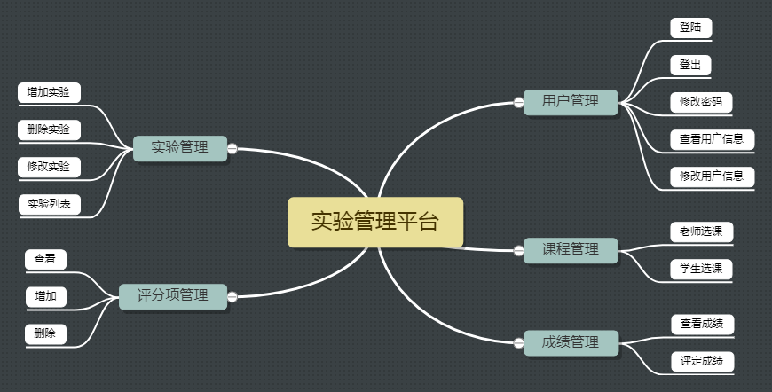
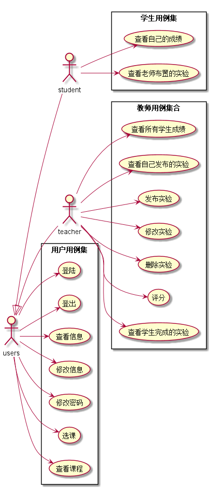
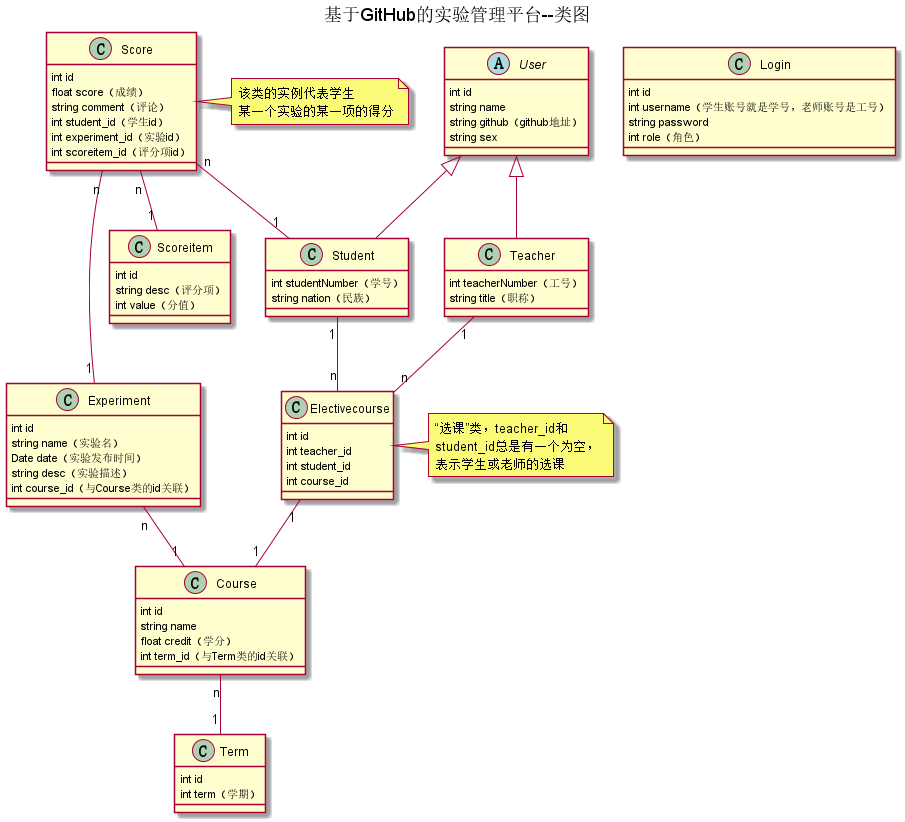

<!-- markdownlint-disable MD033-->
<!-- 禁止MD033类型的警告 https://www.npmjs.com/package/markdownlint -->

# 基于GitHub的实验管理平台的分析与设计

### 成都大学信息科学与工程学院

|学号|班级|姓名|照片|
|:-------:|:-------------: | :----------:|:---:|
|201510******|软件(本)15-1|*著||

## 1. 概述
- 基于GitHub的实验管理平台的作用是在线管理实验成绩的Web应用系统。学生和老师的实验内容均存放在GitHUB
页面上。
- 学生的功能主要有：①修改自己的信息②查询自己的实验成绩③修改密码④查看实验⑤选课⑥查看任课老师信息
   学生的个人信息中包含github地址。老师可以查看所有学生的github地址，学生只能查看自己的
- 老师的功能主要有：①修改自己的信息②选课③发布实验④编辑实验的评分项⑤对学生评分⑥修改密码 
  ⑦查看哪些学生选了自己的课程⑧查看学生成绩⑨查看学生做的实验
- 老师和学生都能通过本系统的链接方便地跳转到学生的每个GitHUB实验目录，以便批改实验或者查看实验情况。
- 实验成绩按数字分数计算。一门课有多个实验，每个实验又有多个评分项。
- 系统自动计算每个学生的单个实验的平均分，所有实验平均分

## 2. 系统总体结构

界面设计参见： 【老师端】 https://614756773.github.io/is_analysis/test6/ui/%E5%AE%9E%E9%AA%8C_1.html
               【学生端】 https://614756773.github.io/is_analysis/test6/ui/%E9%80%89%E8%AF%BE.html

## 3. 用例图设计 [源码](src/用例图.puml)

## 4. 类图设计 [源码](src/类图.puml)

## 5. 数据库设计
- ### [参见数据库设计](数据库设计.md)

## 6. 用例及界面详细设计
- ### [“修改学生信息”用例](./用例/修改学生信息.md),[界面](https://614756773.github.io/is_analysis/test6/ui/%E4%BF%AE%E6%94%B9%E5%AD%A6%E7%94%9F%E4%BF%A1%E6%81%AF.html)
- ### [“修改实验”用例](./用例/修改实验.md),[界面](https://614756773.github.io/is_analysis/test6/ui/%E5%AE%9E%E9%AA%8C_1.html)
- ### [“修改密码”用例](./用例/修改密码.md),[界面](https://614756773.github.io/is_analysis/test6/ui/%E4%BF%AE%E6%94%B9%E5%AF%86%E7%A0%81_1.html)
- ### [“修改教师信息”用例](./用例/修改教师信息.md),[界面](https://614756773.github.io/is_analysis/test6/ui/%E4%BF%AE%E6%94%B9%E6%95%99%E5%B8%88%E4%BF%A1%E6%81%AF.html)
- ### [“删除实验”用例](./用例/删除实验.md),[界面](https://614756773.github.io/is_analysis/test6/ui/%E5%AE%9E%E9%AA%8C_1.html)
- ### [“发布实验”用例](./用例/发布实验.md),[界面](https://614756773.github.io/is_analysis/test6/ui/%E5%AE%9E%E9%AA%8C_1.html)
- ### [“学生查看成绩”用例](./用例/学生查看成绩.md),[界面](https://614756773.github.io/is_analysis/test6/ui/%E6%9F%A5%E7%9C%8B%E6%88%90%E7%BB%A9.html)
- ### [“学生选课”用例](./用例/学生选课.md),[界面](https://614756773.github.io/is_analysis/test6/ui/%E9%80%89%E8%AF%BE.html)
- ### [“教师选课”用例](./用例/教师选课.md),[界面](https://614756773.github.io/is_analysis/test6/ui/%E9%80%89%E8%AF%BE_1.html)
- ### [“查看学生信息”用例](./用例/查看学生信息.md),[界面](https://614756773.github.io/is_analysis/test6/ui/%E5%AD%A6%E7%94%9F%E4%BF%A1%E6%81%AF.html)
- ### [“查看学生完成的实验”用例](./用例/查看学生完成的实验.md),[界面](https://614756773.github.io/is_analysis/test6/ui/%E8%AF%84%E5%88%86.html)
- ### [“查看老师信息”用例](./用例/查看老师信息.md),[界面](https://614756773.github.io/is_analysis/test6/ui/%E6%95%99%E5%B8%88%E4%BF%A1%E6%81%AF_1.html)
- ### [“查看老师布置的实验”用例](./用例/查看老师布置的实验.md),[界面](https://614756773.github.io/is_analysis/test6/ui/%E5%AE%9E%E9%AA%8C.html)
- ### [“登出”用例](./用例/登出.md),[界面](https://614756773.github.io/is_analysis/test6/ui/%E5%AE%9E%E9%AA%8C.html)
- ### [“登陆”用例](./用例/登陆.md),[界面](https://614756773.github.io/is_analysis/test6/ui/%E7%99%BB%E9%99%86.html)
- ### [“老师查看成绩”用例](./用例/老师查看成绩.md),[界面](https://614756773.github.io/is_analysis/test6/ui/%E6%9F%A5%E7%9C%8B%E6%88%90%E7%BB%A9_1.html)
- ### [“老师查看课程”用例](./用例/老师查看课程.md),[界面](https://614756773.github.io/is_analysis/test6/ui/%E9%80%89%E8%AF%BE_1.html)
- ### [“评分”用例](./用例/评分.md),[界面](https://614756773.github.io/is_analysis/test6/ui/%E8%AF%84%E5%88%86.html)
