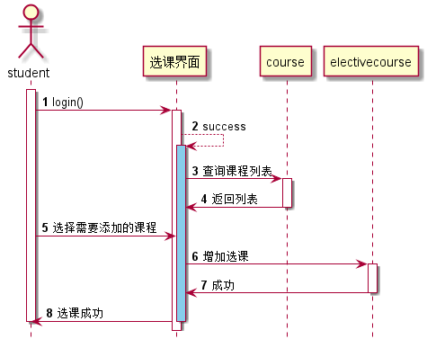

<!-- markdownlint-disable MD033-->
<!-- 禁止MD033类型的警告 https://www.npmjs.com/package/markdownlint -->

# “学生选课”用例 [返回](../README.md)
## 1. 用例规约

|用例名称|查看用户信息|
|-------|:-------------|
|功能|学生选择要上的课程|
|参与者|学生|
|前置条件|必须先登录，而且要老师先选课程后 学生才能选择|
|后置条件||
|主事件流| |
|备选事件流| |

## 2. 业务流程 [源码](../src/学生选课.puml)

## 3. 界面设计
- 界面参照: https://614756773.github.io/is_analysis/test6/ui/选课.html
- API接口调用
    - 接口1：[studentSelectCourse](../接口/studentSelectCourse.md)

## 4. 算法描述
- 学生可能同时选多门课程，把课程的id号连在一起用逗号分割传给后台 
比如：“1006,1234,1089”。后台接受数据后再做分割处理
    
## 5. 参照表
- [student](../数据库设计.md/#student)
- [teacher](../数据库设计.md/#teacher)
- [course](../数据库设计.md/#course)
- [electivecourse](../数据库设计.md/#electivecourse)
- [term](../数据库设计.md/#term)

