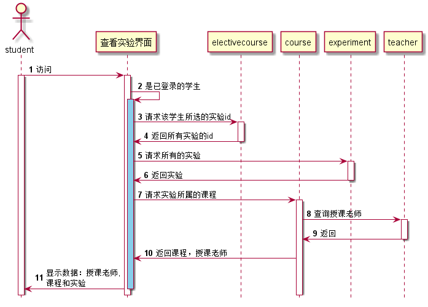

<!-- markdownlint-disable MD033-->
<!-- 禁止MD033类型的警告 https://www.npmjs.com/package/markdownlint -->

# “查看老师布置的实验”用例 [返回](../README.md)
## 1. 用例规约

|用例名称|查看老师布置的实验|
|-------|:-------------|
|功能|查看老师布置的所有实验 这儿的实验是学生已选课 程的实验|
|参与者|学生|
|前置条件|必须先登录|
|后置条件| |
|主事件流| |
|备选事件流| |

## 2. 业务流程 [源码](../src/查看老师布置的实验.puml)

## 3. 界面设计
- 界面参照: https://614756773.github.io/is_analysis/test6/ui/实验.html
- API接口调用
    - 接口1：[stuLookExperiment](../接口/stuLookExperiment.md)

## 4. 算法描述
无

## 5. 参照表
- [teacher](../数据库设计.md/#teacher)
- [term](../数据库设计.md/#term)
- [course](../数据库设计.md/#course)
- [electivecourse](../数据库设计.md/#electivecourse)
- [experiment](../数据库设计.md/#experiment)
