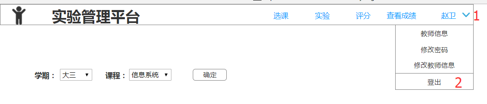

<!-- markdownlint-disable MD033-->
<!-- 禁止MD033类型的警告 https://www.npmjs.com/package/markdownlint -->

# “登出”用例 [返回](../README.md)

## 1. 用例规约

|用例名称|登出|
|-------|:-------------|
|功能|用户登出平台|
|参与者|学生/老师|
|前置条件| |
|后置条件|登出后，跳转到登录页面|
|主事件流| 1. 系统清除客户端登录信息（Cookie）|

## 2. 业务流程
无

## 3. 界面设计
- 界面参照: https://614756773.github.io/is_analysis/test6/ui/查看成绩_1.html
- 操作步骤: 
- API接口调用
    - 接口1：[logout](../接口/logout.md)

## 4. 算法描述
    
## 5. 参照表

- [login](../数据库设计.md/#login)

