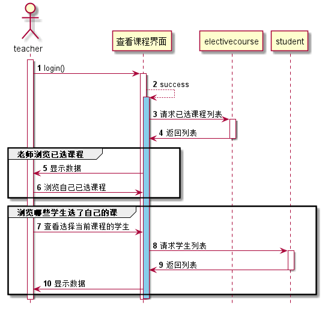

<!-- markdownlint-disable MD033-->
<!-- 禁止MD033类型的警告 https://www.npmjs.com/package/markdownlint -->

# “老师查看课程”用例 [返回](../README.md)
## 1. 用例规约

|用例名称|查看用户信息|
|-------|:-------------|
|功能|老师查看自己已选的课程，并且能够 查看哪些学生选了自己的课|
|参与者|老师|
|前置条件|必须先登录|
|后置条件| |
|主事件流| |
|备选事件流| |

## 2. 业务流程 [源码](../src/老师查看课程.puml)

## 3. 界面设计
- 界面参照: https://614756773.github.io/is_analysis/test6/ui/选课_1.html
- API接口调用
    - 接口1：[teacherLookCourse](../接口/teacherLookCourse.md)

## 4. 算法描述

## 5. 参照表
- [teacher](../数据库设计.md/#teacher)
- [course](../数据库设计.md/#course)
- [electivecourse](../数据库设计.md/#electivecourse)
- [student](../数据库设计.md/#student)
